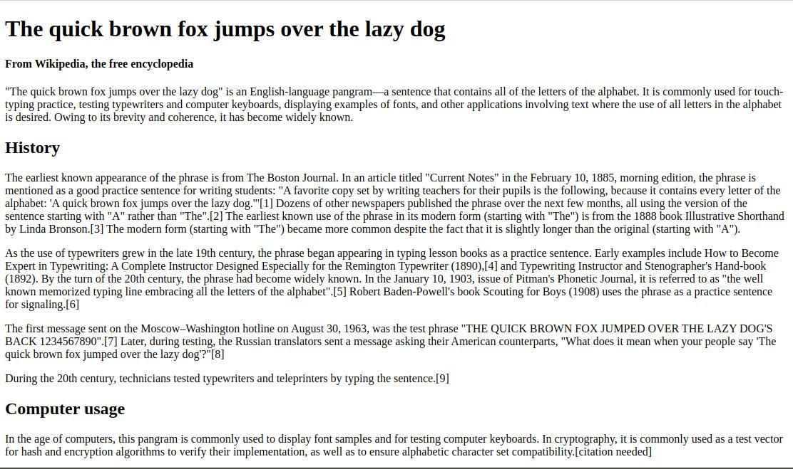

# Make a Wikipedia Website 

### Tasks
1. Open the file `exercise.html` in your code editor.
2. Wrap each line of text with a suitable **HTML** tag so the page looks exactly as the following image.
